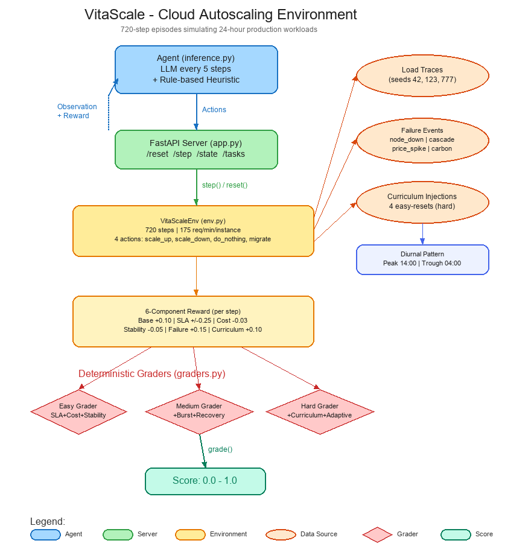

# VitaScale: Long-Horizon Dynamic Resource Orchestrator

An OpenEnv environment where AI agents learn to manage cloud infrastructure at scale. The agent controls a fleet of compute instances serving real-time web traffic, balancing **cost efficiency**, **SLA compliance**, and **resilience** over 24-hour production windows.

## Motivation

Cloud autoscaling is a **real task done millions of times daily** by infrastructure teams. Current autoscalers use simple threshold rules (CPU > 70% → add instance) that waste money during low traffic and fail during spikes. This environment lets AI agents learn sophisticated strategies:

- Anticipate diurnal patterns and pre-scale
- React to traffic bursts before SLA violations cascade  
- Survive node failures and price spikes gracefully
- Optimize the cost-reliability tradeoff

**This environment uniquely combines long-horizon non-stationary dynamics with curriculum-based easy-task injections to prevent agent forgetting — a feature not seen in prior autoscaling environments.** The rich multi-component reward signal (SLA + cost + stability + resilience + curriculum) provides dense feedback over 720-step episodes, making it well-suited for both RL training and LLM agent evaluation.

## Action Space (`Action`)

| Field | Type | Description |
|-------|------|-------------|
| `action_type` | `Literal["scale_up", "scale_down", "do_nothing", "migrate_load"]` | Scaling action to take |
| `num_instances` | `int (0-20)` | Number of instances to add/remove |

## Observation Space (`Observation`)

| Field | Type | Description |
|-------|------|-------------|
| `timestamp` | `int` | Minutes since episode start |
| `current_load` | `float` | Requests per minute (0-5000) |
| `cpu_util` | `float` | CPU utilization 0.0-1.0 |
| `memory_util` | `float` | Memory utilization 0.0-1.0 |
| `instance_count` | `int` | Current fleet size |
| `cost_so_far` | `float` | Cumulative cost in $ |
| `sla_violation_minutes` | `int` | Minutes where load exceeded capacity |
| `recent_events` | `List[str]` | Recent failures/events |
| `difficulty_level` | `int` | 1=easy, 2=medium, 3=hard |
| `pending_requests` | `float` | Queued unserved requests |
| `avg_response_time_ms` | `float` | Simulated avg response time |

## Reward Design

Per-step reward provides rich signal (not binary):
- **Base**: +0.10 for running the system
- **SLA compliance**: +0.25 if no violation, up to -0.40 proportional to overload
- **Cost efficiency**: -0.03 per excess instance beyond needed + 2 buffer
- **Stability**: -0.05 per scaling action (penalizes thrashing)
- **Failure handling**: +0.15 for surviving a failure without SLA breach
- **Curriculum**: +0.10 for efficient scaling during easy-reset periods

## Tasks

| # | Task | Difficulty | Description |
|---|------|-----------|-------------|
| 1 | `easy_bench` | Easy | Stable diurnal traffic, no failures. Learn the daily rhythm. |
| 2 | `medium_bench` | Medium | Diurnal + 6 traffic bursts + 2 node failures. React and recover. |
| 3 | `hard_bench` | Hard | Full chaos: noisy load, cascading failures, price/carbon spikes, curriculum injections. |

### Grading (0.0-1.0 with partial credit)

**Easy**: SLA violations (40%), cost efficiency (35%), stability (25%)
**Medium**: SLA (35%), cost (30%), burst response (20%), failure recovery (15%)
**Hard**: SLA (25%), cost (25%), failure survival (20%), adaptive scaling (15%), curriculum response (15%)

## Reference Baseline Scores (hybrid LLM + heuristic agent)

| Task | Baseline Score | SLA Violations | Cost | Notes |
|------|---------------|---------------|------|-------|
| easy_bench | 0.82 | 0 min | $554 | Perfect SLA; cost optimization is main challenge |
| medium_bench | 0.68 | 3 min | $650 | Burst response timing is key differentiator |
| hard_bench | 0.76 | 11 min | $761 | Curriculum response + failure survival needed |

These scores are reported using the submitted baseline `inference.py`, which queries an OpenAI-compatible model every 5 steps and falls back to deterministic scaling heuristics between model calls.

## Setup & Usage

### Local

```bash
pip install -r requirements.txt
uvicorn app:app --host 0.0.0.0 --port 7860

# In another terminal
export API_BASE_URL="https://api.openai.com/v1"
export MODEL_NAME="gpt-4o-mini"
export HF_TOKEN="your-key"
export ENV_URL="http://localhost:7860"
python inference.py
```

### Docker

```bash
docker build -t vitascale .
docker run -p 7860:7860 vitascale
```

### Built-in OpenEnv Web Interface

This project uses the built-in OpenEnv interactive web interface.
No separate `openenv-core[gui]` extra is required here — the `openenv-core`
package already includes the web UI dependencies used by the environment.

With `ENABLE_WEB_INTERFACE=true`, open:

```bash
http://localhost:7860/web
```

or on the deployed Space:

```bash
https://kaushikss-vitascale.hf.space/web
```

The `/dashboard` route is provided as a friendly alias that redirects to `/web`.

### API Endpoints

| Method | Path | Description |
|--------|------|-------------|
| GET | `/` | Environment info |
| GET | `/web` | Built-in OpenEnv interactive web interface |
| GET | `/dashboard` | Redirect alias to `/web` |
| GET | `/health` | Health check |
| POST | `/reset?task_id=...` | Reset with a task |
| POST | `/step` | Submit action (body: `{"action_type": "...", "num_instances": N}`) |
| GET | `/state` | Current env state |
| GET | `/tasks` | List available tasks |

## Architecture



```
vitascalenv/
├── models.py          # Typed Pydantic models
├── env.py             # Core environment logic
├── graders.py         # Deterministic 0.0-1.0 graders
├── load_traces.py     # Pre-computed deterministic traces
├── app.py             # FastAPI endpoints
├── server/app.py      # OpenEnv multi-mode server entry point
├── inference.py       # Baseline inference script
├── openenv.yaml       # OpenEnv metadata
├── Dockerfile         # Container config
├── pyproject.toml     # OpenEnv package metadata and scripts
├── requirements.txt   # Dependencies
├── uv.lock            # Locked dependency graph
└── README.md          # This file
```
